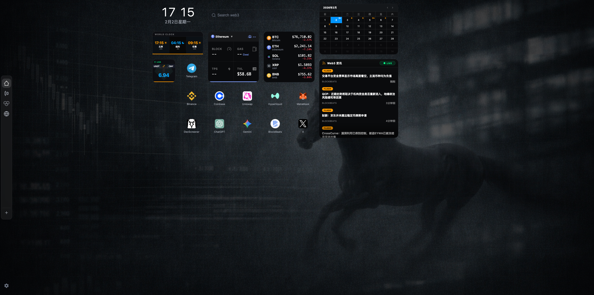

# Desktop for Web3

> 专为 Web3 从业者设计的 Chrome 新标签页扩展。将新标签页转变为信息仪表板，支持拖拽式布局、实时区块链监控、价格跟踪和聚合新闻。

[](https://github.com/hchen13/desktop-for-web3)
[](https://opensource.org/licenses/MIT)
[](https://www.typescriptlang.org/)
[](https://www.solidjs.com/)

## 预览



## 核心特性

- **拖拽式布局系统** - 参考 iOS 体验，支持自由拖放组件
- **实时区块链监控** - 显示 Block Time、Gas、TPS、TVL 等关键指标
- **自定义观察列表** - 通过 WebSocket 实时更新价格
- **聚合 Web3 资讯** - 整合多个加密货币新闻源
- **行业日历** - 追踪加密行业重要事件
- **多时区时钟** - 支持全球主要城市时间显示
- **Bloomberg Terminal 风格主题** - 专业级暗色界面
- **隐私优先** - 本地存储数据，不上传云端

## 架构

```
前端 (SolidJS + TypeScript)
├── 网格系统 - 基于 BFS 算法的拖拽布局引擎
├── 事件系统 - 事件编排与分发
└── 组件库 - 7 个可复用的 Widget 组件

服务层
├── Binance API (WebSocket + REST)
├── DefiLlama API (TVL 数据)
├── RPC 直连 (ETH/SOL/BSC/Polygon)
└── RSS 订阅服务

数据层
├── chrome.storage.local (持久化)
└── 内存缓存 (性能优化)
```

## 快速开始

### 开发环境

```bash
# 安装依赖
npm install

# 启动开发服务器
npm run dev

# 访问 http://localhost:5173/src/newtab/index.html
```

### 构建发布

```bash
# 构建生产版本
npm run build

# 产物在 dist/ 目录
# 在 chrome://extensions/ 加载解压的扩展
```

### Worker 服务（可选）

如需使用完整的链上监控功能，可部署 Cloudflare Worker：

```bash
cd worker

# 安装依赖
npm install

# 本地开发
npm run dev

# 部署到生产
npm run deploy
```

查看 [worker/README.md](worker/README.md) 了解详细配置。

## 组件列表

| 组件 | 说明 | 尺寸 | 数据源 |
|-----------|-------------|------|-------------|
| 资讯组件 | Web3 新闻聚合 | 3×3 | RSS 订阅 |
| 日历组件 | 行业事件日历 | 3×2 | CoinMarketCal |
| 链监控组件 | 区块链指标监控 | 2×2 | RPC + DefiLlama |
| 观察列表 | 价格实时跟踪 | 2×2 | Binance WebSocket |
| 世界时钟 | 多时区时间显示 | 2×1 | 本地时间 |
| 经济地图 | 经济数据热力图 | 3×2 | IMF + World Bank |
| 汇率监控 | 实时汇率显示 | 1×1 | CoinGecko |

## 使用指南

### 拖拽布局

- **拖动组件** - 按住组件拖动到新位置
- **添加组件** - 右键空白区域 → 选择组件类型
- **删除组件** - 右键组件 → 删除
- **添加图标** - 右键空白区域 → 添加图标 → 输入网址

### 切换桌面

- 点击左侧边栏图标切换桌面
- 支持 4 个独立桌面，布局自动保存

### 自定义组件

大部分组件支持右键菜单进行个性化设置：

- **价格监控** - 搜索添加币种，设置自定义分类
- **世界时钟** - 添加/删除城市，最多 4 个时区
- **资讯组件** - 右键刷新最新内容

## 技术栈

- **框架** - [SolidJS](https://www.solidjs.com/) 1.8.22（高性能响应式框架）
- **语言** - [TypeScript](https://www.typescriptlang.org/) 5.3
- **构建** - [Vite](https://vitejs.dev/) 5.0 + [@crxjs/vite-plugin](https://crxjs.dev/)
- **状态管理** - SolidJS Store + chrome.storage.local
- **样式** - CSS Variables（Bloomberg Terminal 风格）
- **测试** - Puppeteer（UI 自动化测试）

## 项目结构

```
src/
├── grid/                    # Grid 布局系统
│   ├── GridContainer.tsx    # 核心布局容器
│   ├── store.ts             # 状态管理
│   ├── utils.ts             # 坐标转换工具
│   └── types.ts             # 类型定义
├── events/                  # 事件系统
│   ├── EventOrchestrator.ts # 事件编排器
│   └── DragSystem.ts        # 拖拽算法（BFS）
├── components/
│   └── Widgets/             # 7 个 Widget 组件
├── services/                # 数据服务
│   ├── binance/             # Binance API
│   ├── chain-monitor/       # 链上数据
│   └── rssService.ts        # RSS 订阅
└── config/                  # 配置文件
    └── defaultLayouts.json  # 预设布局
```

## 配置

### 自定义默认布局

编辑 `src/config/defaultLayouts.json`：

```json
{
  "desktop-1": {
    "name": "主桌面",
    "elements": [
      {
        "id": "widget-news",
        "type": "widget",
        "component": "news",
        "position": { "x": 2, "y": 2 },
        "size": { "width": 3, "height": 3 }
      }
    ]
  }
}
```

### 添加自定义图标

编辑 `src/grid/tabIconConfig.ts`：

```typescript
export const ICON_CONFIG = {
  'custom-icon': {
    name: '自定义',
    url: 'https://example.com',
    category: 'tools'
  }
}
```

## 测试

```bash
# 运行 UI 自动化测试
npm run test

# 快速测试（跳过部分检查）
npm run test:quick
```

测试报告和截图保存在 `tests/screenshots/` 目录。

## 文档

- [CLAUDE.md](CLAUDE.md) - 完整技术文档
- [网格系统设计](design/layout/grid-system-design.md) - 布局系统详解
- [链监控实现](docs/chain-monitor-implementation-summary.md) - 架构概览
- [Worker 部署指南](worker/README.md) - Cloudflare Worker 配置

## 贡献

欢迎贡献！请随时提交 Issues 和 Pull Requests。

1. Fork 本仓库
2. 创建特性分支 (`git checkout -b feature/AmazingFeature`)
3. 提交更改 (`git commit -m 'feat: add amazing feature'`)
4. 推送到分支 (`git push origin feature/AmazingFeature`)
5. 开启 Pull Request

### 提交规范

遵循 [Conventional Commits](https://www.conventionalcommits.org/)：

- `feat` - 新功能
- `fix` - 错误修复
- `docs` - 文档更新
- `style` - 代码格式化
- `refactor` - 代码重构
- `perf` - 性能优化
- `test` - 测试相关
- `chore` - 构建/工具链

## 开源协议

[MIT License](LICENSE) © 2026

## 致谢

- 界面设计灵感来自 [Bloomberg Terminal](https://www.bloomberg.com/professional/solution/bloomberg-terminal/)
- 图标服务由 [icon.horse](https://icon.horse/) 提供
- 区块链数据来自 [DefiLlama](https://defillama.com/)
- 价格数据来自 [Binance API](https://www.binance.com/en/binance-api)

## 相关链接

- [Issues](https://github.com/hchen13/desktop-for-web3/issues)
- [更新日志](CHANGELOG.md)
